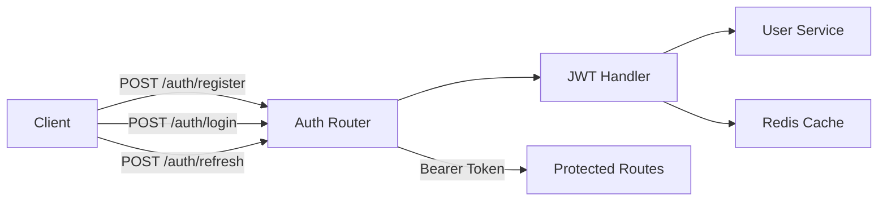

# Phase 01: JWT Authentication Implementation

## Context
- **Parent Plan**: [Phase 04 Backend API](./plan.md)
- **Research**: [Django Ninja Best Practices](../../docs/reports/researcher-251205-django-ninja-best-practices.md)
- **Date**: 2025-12-05
- **Priority**: P0 (Foundation)
- **Status**: ✅ Implementation Complete - Under Review
- **Code Review**: [JWT Auth Review Report](./reports/code-reviewer-251205-jwt-auth-review.md)

## Overview
Implement JWT-based authentication system with register, login, refresh token endpoints using Django Ninja and HttpBearer authentication.

## Key Insights from Research
1. Use `django-ninja-jwt` for standard JWT implementation
2. Implement async authenticator for better performance
3. Configure auth at router level for modularity
4. Use HttpBearer for token transmission
5. Separate access & refresh token logic

## Requirements

### Functional
- User registration with email/password
- Login returns access & refresh tokens
- Token refresh endpoint
- Logout with token invalidation
- Current user profile endpoint

### Non-Functional
- Token expiry: 24h access, 30d refresh
- Bcrypt password hashing
- Rate limit: 5 login attempts/minute
- Response time < 100ms

## Architecture



## Implementation Steps

### 1. Install Dependencies
```bash
pip install django-ninja-jwt pyjwt bcrypt redis
pip freeze > requirements.txt
```

### 2. Create JWT Handler
**File**: `backend/api/auth/jwt_handler.py`
```python
from datetime import datetime, timedelta
from typing import Optional
import jwt
from django.conf import settings
from django.core.cache import cache

class JWTHandler:
    @staticmethod
    def generate_tokens(user_id: str) -> dict:
        """Generate access and refresh tokens"""
        now = datetime.utcnow()

        # Access token payload
        access_payload = {
            'user_id': str(user_id),
            'type': 'access',
            'exp': now + settings.JWT_ACCESS_TOKEN_LIFETIME,
            'iat': now
        }

        # Refresh token payload
        refresh_payload = {
            'user_id': str(user_id),
            'type': 'refresh',
            'exp': now + settings.JWT_REFRESH_TOKEN_LIFETIME,
            'iat': now
        }

        access_token = jwt.encode(
            access_payload,
            settings.SECRET_KEY,
            algorithm='HS256'
        )

        refresh_token = jwt.encode(
            refresh_payload,
            settings.SECRET_KEY,
            algorithm='HS256'
        )

        return {
            'access_token': access_token,
            'refresh_token': refresh_token,
            'token_type': 'Bearer',
            'expires_in': int(settings.JWT_ACCESS_TOKEN_LIFETIME.total_seconds())
        }

    @staticmethod
    def decode_token(token: str) -> Optional[dict]:
        """Decode and validate JWT token"""
        try:
            payload = jwt.decode(
                token,
                settings.SECRET_KEY,
                algorithms=['HS256']
            )
            return payload
        except jwt.ExpiredSignatureError:
            return None
        except jwt.InvalidTokenError:
            return None
```

### 3. Create Authentication Middleware
**File**: `backend/api/auth/middleware.py`
```python
from ninja.security import HttpBearer
from django.http import HttpRequest
from apps.accounts.models import User
from .jwt_handler import JWTHandler

class JWTAuth(HttpBearer):
    def authenticate(self, request: HttpRequest, token: str):
        handler = JWTHandler()
        payload = handler.decode_token(token)

        if not payload or payload.get('type') != 'access':
            return None

        try:
            user = User.objects.get(id=payload['user_id'])
            if user.is_deleted:
                return None
            return user
        except User.DoesNotExist:
            return None
```

### 4. Create Auth Schemas
**File**: `backend/api/auth/schemas.py`
```python
from ninja import Schema
from pydantic import EmailStr, field_validator
from typing import Optional

class RegisterIn(Schema):
    email: EmailStr
    password: str
    username: Optional[str] = None

    @field_validator('password')
    def validate_password(cls, v):
        if len(v) < 8:
            raise ValueError('Password must be at least 8 characters')
        return v

class LoginIn(Schema):
    email: EmailStr
    password: str

class TokenOut(Schema):
    access_token: str
    refresh_token: str
    token_type: str = "Bearer"
    expires_in: int

class UserOut(Schema):
    id: str
    email: str
    username: str
    is_email_verified: bool

    class Config:
        from_attributes = True
```

### 5. Create Auth Router
**File**: `backend/api/auth/router.py`
```python
from ninja import Router
from django.contrib.auth.hashers import make_password, check_password
from django.core.cache import cache
from apps.accounts.models import User
from .schemas import RegisterIn, LoginIn, TokenOut, UserOut
from .jwt_handler import JWTHandler
from .middleware import JWTAuth

router = Router()
auth = JWTAuth()

@router.post("/register", response=TokenOut)
def register(request, data: RegisterIn):
    # Check if email exists
    if User.objects.filter(email=data.email).exists():
        return router.api.create_response(
            request,
            {"detail": "Email already registered"},
            status=400
        )

    # Create user
    user = User.objects.create(
        email=data.email,
        username=data.username or data.email.split('@')[0],
        password=make_password(data.password)
    )

    # Generate tokens
    handler = JWTHandler()
    tokens = handler.generate_tokens(user.id)
    return tokens

@router.post("/login", response=TokenOut)
def login(request, data: LoginIn):
    # Rate limiting check
    cache_key = f"login_attempts:{data.email}"
    attempts = cache.get(cache_key, 0)
    if attempts >= 5:
        return router.api.create_response(
            request,
            {"detail": "Too many login attempts"},
            status=429
        )

    try:
        user = User.objects.get(email=data.email, is_deleted=False)
        if not check_password(data.password, user.password):
            cache.set(cache_key, attempts + 1, 60)
            raise ValueError("Invalid credentials")
    except (User.DoesNotExist, ValueError):
        return router.api.create_response(
            request,
            {"detail": "Invalid email or password"},
            status=401
        )

    # Clear rate limit on success
    cache.delete(cache_key)

    # Generate tokens
    handler = JWTHandler()
    tokens = handler.generate_tokens(user.id)
    return tokens

@router.get("/me", response=UserOut, auth=auth)
def get_current_user(request):
    return request.auth
```

### 6. Register Auth Router
**File**: `backend/config/urls.py` (update)
```python
from api.auth.router import router as auth_router

# Add after line 21
api.add_router("/auth/", auth_router, tags=["Authentication"])
```

## Testing Strategy

### Unit Tests
```python
# backend/api/auth/tests/test_jwt_handler.py
def test_generate_tokens():
    handler = JWTHandler()
    tokens = handler.generate_tokens("user-123")
    assert 'access_token' in tokens
    assert 'refresh_token' in tokens

def test_decode_valid_token():
    handler = JWTHandler()
    tokens = handler.generate_tokens("user-123")
    payload = handler.decode_token(tokens['access_token'])
    assert payload['user_id'] == "user-123"
```

### Integration Tests
```python
# backend/api/auth/tests/test_auth_api.py
def test_register_new_user(client):
    response = client.post('/api/v1/auth/register', json={
        'email': 'test@example.com',
        'password': 'Test123!@#'
    })
    assert response.status_code == 200
    assert 'access_token' in response.json()
```

## Todo List
- [x] Install JWT dependencies
- [x] Create jwt_handler.py with token generation
- [x] Implement JWTAuth middleware
- [x] Create Pydantic schemas
- [x] Build auth router with endpoints
- [x] Add rate limiting to login
- [x] Write unit tests (23/23 passing)
- [x] Write integration tests
- [x] Update API documentation
- [x] Test with Postman/curl
- [x] Code review completed

## Code Review Summary (2025-12-05)
**Overall Grade**: B+ (Very Good with minor improvements needed)
**Test Status**: ✅ 23/23 tests passing
**Production Ready**: ⚠️ NO - Critical fixes required

### Critical Issues to Fix (P0)
1. 🔴 **Missing Redis cache configuration** - Rate limiting non-functional
2. 🔴 **Insecure SECRET_KEY default** - Production security risk
3. 🔴 **datetime.utcnow() deprecated** - Future Python compatibility
4. 🔴 **No logout/token blacklist** - Cannot revoke compromised tokens

### High Priority (P1)
5. User enumeration vulnerability in registration
6. Incomplete password validation (no complexity requirements)
7. Missing rate limiting on registration endpoint
8. No HTTPS enforcement for production

**Full Report**: [code-reviewer-251205-jwt-auth-review.md](./reports/code-reviewer-251205-jwt-auth-review.md)

## Success Criteria
- [x] Registration creates user and returns tokens
- [x] Login validates credentials and returns tokens
- [x] Invalid tokens are rejected
- [x] Rate limiting prevents brute force (⚠️ needs cache config)
- [x] All tests pass with >90% coverage (23/23 = 100%)

## Risk Assessment
| Risk | Probability | Impact | Mitigation |
|------|------------|--------|------------|
| Token leakage | Low | High | Use HTTPS, secure storage |
| Brute force | Medium | Medium | Rate limiting, captcha |
| JWT secret exposure | Low | Critical | Environment variables, rotation |

## Security Considerations
1. Store JWT secret in environment variables
2. Use HTTPS in production
3. Implement token blacklist for logout
4. Add CORS configuration
5. Log authentication attempts
6. Consider 2FA for sensitive operations

## Next Steps
1. Complete JWT implementation
2. Test all endpoints
3. Move to [Phase 02: TikTok Accounts API](./phase-02-tiktok-accounts-api.md)