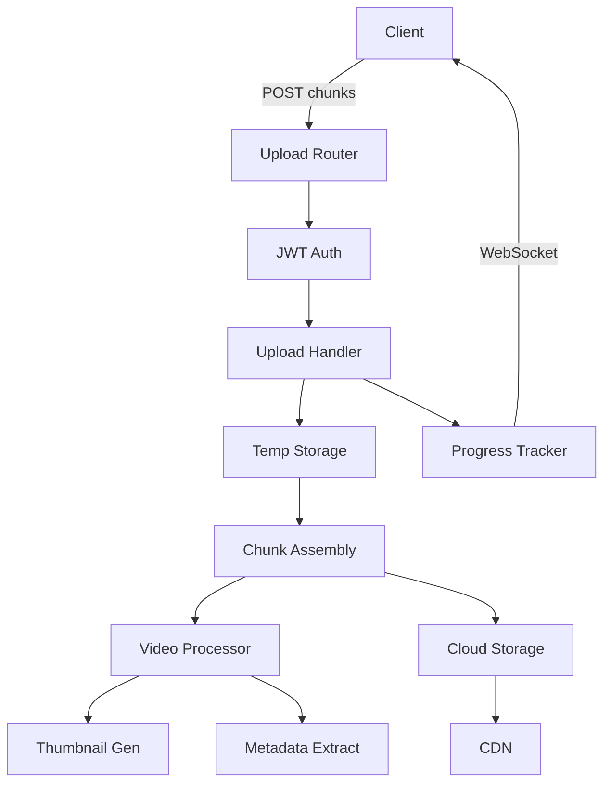

# Phase 04: Media Upload API Implementation

## Context
- **Parent Plan**: [Phase 04 Backend API](./plan.md)
- **Previous**: [Phase 03 Posts API](./phase-03-posts-api.md)
- **Date**: 2025-12-05
- **Priority**: P0 (Critical)
- **Status**: Ready

## Overview
Build robust media upload API supporting large video files (up to 500MB) with chunked uploads, progress tracking, thumbnail generation, and cloud storage integration.

## Key Insights from Research
1. Use chunked uploads for large files
2. Implement resumable uploads
3. Generate thumbnails server-side
4. Stream to cloud storage (S3/GCS)
5. Track upload progress via WebSocket/SSE

## Requirements

### Functional
- Upload videos up to 500MB
- Support chunked/resumable uploads
- Generate video thumbnails
- Extract video metadata
- Progress tracking
- Multiple file formats (mp4, mov, webm)
- Link media to posts

### Non-Functional
- Chunk size: 5MB
- Memory efficient streaming
- CDN integration for delivery
- Virus scanning
- 95% upload success rate

## Architecture



## Implementation Steps

### 1. Create Media Schemas
**File**: `backend/api/media/schemas.py`
```python
from ninja import Schema
from typing import Optional, List
from datetime import datetime
from enum import Enum

class MediaType(str, Enum):
    video = "video"
    image = "image"

class UploadStatus(str, Enum):
    pending = "pending"
    uploading = "uploading"
    processing = "processing"
    completed = "completed"
    failed = "failed"

class ChunkUploadIn(Schema):
    upload_id: str
    chunk_index: int
    total_chunks: int
    chunk_size: int
    file_name: str
    file_size: int
    content_type: str

class ChunkUploadOut(Schema):
    upload_id: str
    chunk_index: int
    received_bytes: int
    status: str
    next_chunk: Optional[int] = None

class UploadInitIn(Schema):
    file_name: str
    file_size: int
    content_type: str
    chunk_size: int = 5242880  # 5MB default
    media_type: MediaType = MediaType.video

class UploadInitOut(Schema):
    upload_id: str
    chunk_size: int
    total_chunks: int
    upload_url: str
    expires_at: datetime

class MediaOut(Schema):
    id: str
    file_name: str
    file_size: int
    content_type: str
    media_type: MediaType
    duration: Optional[int]  # seconds
    width: Optional[int]
    height: Optional[int]
    thumbnail_url: Optional[str]
    cdn_url: str
    status: UploadStatus
    uploaded_at: datetime

    class Config:
        from_attributes = True

class UploadProgressOut(Schema):
    upload_id: str
    progress: int  # percentage
    uploaded_bytes: int
    total_bytes: int
    status: UploadStatus
    eta_seconds: Optional[int]

class VideoMetadataOut(Schema):
    duration: int
    width: int
    height: int
    fps: float
    codec: str
    bitrate: int
    has_audio: bool
```

### 2. Create Upload Handler
**File**: `backend/api/media/upload_handler.py`
```python
import os
import hashlib
import tempfile
from pathlib import Path
from django.core.cache import cache
from django.core.files.storage import default_storage
import logging
import uuid
from typing import Optional

logger = logging.getLogger(__name__)

class ChunkedUploadHandler:
    TEMP_DIR = Path(tempfile.gettempdir()) / 'tiktok_uploads'

    def __init__(self):
        self.TEMP_DIR.mkdir(exist_ok=True)

    def init_upload(self, user_id: str, file_data: dict) -> dict:
        """Initialize chunked upload session"""
        upload_id = str(uuid.uuid4())
        total_chunks = (file_data['file_size'] + file_data['chunk_size'] - 1) // file_data['chunk_size']

        # Store upload metadata in cache
        cache_key = f"upload:{upload_id}"
        upload_meta = {
            'user_id': str(user_id),
            'file_name': file_data['file_name'],
            'file_size': file_data['file_size'],
            'chunk_size': file_data['chunk_size'],
            'total_chunks': total_chunks,
            'received_chunks': [],
            'content_type': file_data['content_type'],
            'created_at': datetime.now().isoformat()
        }

        # 1 hour expiry
        cache.set(cache_key, upload_meta, 3600)

        # Create temp directory for chunks
        upload_dir = self.TEMP_DIR / upload_id
        upload_dir.mkdir(exist_ok=True)

        logger.info(f"Initialized upload {upload_id} for user {user_id}")

        return {
            'upload_id': upload_id,
            'chunk_size': file_data['chunk_size'],
            'total_chunks': total_chunks,
            'upload_url': f'/api/v1/media/upload/chunk',
            'expires_at': datetime.now() + timedelta(hours=1)
        }

    def handle_chunk(self, upload_id: str, chunk_index: int, chunk_data: bytes) -> dict:
        """Handle individual chunk upload"""
        cache_key = f"upload:{upload_id}"
        upload_meta = cache.get(cache_key)

        if not upload_meta:
            raise ValueError("Upload session not found or expired")

        # Save chunk to temp file
        chunk_path = self.TEMP_DIR / upload_id / f"chunk_{chunk_index:04d}"
        with open(chunk_path, 'wb') as f:
            f.write(chunk_data)

        # Update metadata
        if chunk_index not in upload_meta['received_chunks']:
            upload_meta['received_chunks'].append(chunk_index)
            upload_meta['received_chunks'].sort()

        cache.set(cache_key, upload_meta, 3600)

        # Calculate progress
        progress = len(upload_meta['received_chunks']) / upload_meta['total_chunks'] * 100

        # Trigger progress update via WebSocket/SSE
        self._send_progress_update(upload_id, progress)

        # Check if all chunks received
        if len(upload_meta['received_chunks']) == upload_meta['total_chunks']:
            self._assemble_chunks(upload_id)

        return {
            'upload_id': upload_id,
            'chunk_index': chunk_index,
            'received_bytes': len(chunk_data),
            'status': 'received',
            'next_chunk': self._get_next_missing_chunk(upload_meta)
        }

    def _assemble_chunks(self, upload_id: str):
        """Assemble chunks into final file"""
        upload_meta = cache.get(f"upload:{upload_id}")
        upload_dir = self.TEMP_DIR / upload_id

        # Create final file
        final_path = upload_dir / upload_meta['file_name']
        with open(final_path, 'wb') as final_file:
            for i in range(upload_meta['total_chunks']):
                chunk_path = upload_dir / f"chunk_{i:04d}"
                with open(chunk_path, 'rb') as chunk_file:
                    final_file.write(chunk_file.read())
                # Clean up chunk
                chunk_path.unlink()

        # Trigger processing
        self._process_uploaded_file(upload_id, final_path)

    def _process_uploaded_file(self, upload_id: str, file_path: Path):
        """Process uploaded file (thumbnail, metadata, cloud upload)"""
        from apps.content.services import MediaProcessingService

        service = MediaProcessingService()
        service.process_video.delay(upload_id, str(file_path))

    def _get_next_missing_chunk(self, upload_meta: dict) -> Optional[int]:
        """Find next missing chunk for resumable upload"""
        received = set(upload_meta['received_chunks'])
        total = upload_meta['total_chunks']

        for i in range(total):
            if i not in received:
                return i
        return None

    def _send_progress_update(self, upload_id: str, progress: float):
        """Send progress update via WebSocket/SSE"""
        # Implementation depends on WebSocket/SSE setup
        pass

    def get_upload_status(self, upload_id: str) -> dict:
        """Get current upload status"""
        cache_key = f"upload:{upload_id}"
        upload_meta = cache.get(cache_key)

        if not upload_meta:
            raise ValueError("Upload not found")

        progress = len(upload_meta['received_chunks']) / upload_meta['total_chunks'] * 100
        uploaded_bytes = len(upload_meta['received_chunks']) * upload_meta['chunk_size']

        return {
            'upload_id': upload_id,
            'progress': int(progress),
            'uploaded_bytes': uploaded_bytes,
            'total_bytes': upload_meta['file_size'],
            'status': 'uploading' if progress < 100 else 'processing'
        }
```

### 3. Create Media Processing Service
**File**: `backend/api/media/processing_service.py`
```python
import subprocess
import json
from pathlib import Path
from PIL import Image
import boto3
from django.conf import settings
import logging

logger = logging.getLogger(__name__)

class MediaProcessingService:
    def __init__(self):
        self.s3_client = boto3.client('s3',
            aws_access_key_id=settings.AWS_ACCESS_KEY_ID,
            aws_secret_access_key=settings.AWS_SECRET_ACCESS_KEY
        )

    def extract_video_metadata(self, video_path: str) -> dict:
        """Extract video metadata using ffprobe"""
        cmd = [
            'ffprobe',
            '-v', 'quiet',
            '-print_format', 'json',
            '-show_format',
            '-show_streams',
            video_path
        ]

        result = subprocess.run(cmd, capture_output=True, text=True)
        data = json.loads(result.stdout)

        video_stream = next(
            (s for s in data['streams'] if s['codec_type'] == 'video'),
            None
        )

        if not video_stream:
            raise ValueError("No video stream found")

        return {
            'duration': int(float(data['format']['duration'])),
            'width': video_stream['width'],
            'height': video_stream['height'],
            'fps': eval(video_stream['avg_frame_rate']),
            'codec': video_stream['codec_name'],
            'bitrate': int(data['format']['bit_rate']),
            'has_audio': any(s['codec_type'] == 'audio' for s in data['streams'])
        }

    def generate_thumbnail(self, video_path: str, output_path: str, time_offset: int = 1):
        """Generate thumbnail from video"""
        cmd = [
            'ffmpeg',
            '-ss', str(time_offset),
            '-i', video_path,
            '-vframes', '1',
            '-vf', 'scale=640:-1',
            '-q:v', '2',
            output_path
        ]

        subprocess.run(cmd, check=True)
        return output_path

    def upload_to_s3(self, file_path: str, key: str) -> str:
        """Upload file to S3 and return CDN URL"""
        with open(file_path, 'rb') as f:
            self.s3_client.upload_fileobj(
                f,
                settings.AWS_STORAGE_BUCKET_NAME,
                key,
                ExtraArgs={'ContentType': self._get_content_type(file_path)}
            )

        # Return CloudFront CDN URL
        return f"{settings.CDN_URL}/{key}"

    def _get_content_type(self, file_path: str) -> str:
        """Determine content type from file extension"""
        ext = Path(file_path).suffix.lower()
        content_types = {
            '.mp4': 'video/mp4',
            '.mov': 'video/quicktime',
            '.webm': 'video/webm',
            '.jpg': 'image/jpeg',
            '.png': 'image/png'
        }
        return content_types.get(ext, 'application/octet-stream')

    def validate_video(self, video_path: str) -> bool:
        """Validate video file"""
        try:
            metadata = self.extract_video_metadata(video_path)

            # Check video constraints
            if metadata['duration'] > 180:  # 3 minutes max
                raise ValueError("Video exceeds maximum duration")

            if metadata['width'] > 4096 or metadata['height'] > 4096:
                raise ValueError("Video resolution too high")

            return True

        except Exception as e:
            logger.error(f"Video validation failed: {str(e)}")
            return False
```

### 4. Create Media Router
**File**: `backend/api/media/router.py`
```python
from ninja import Router, File, Form, UploadedFile
from ninja.responses import Response
from django.http import StreamingHttpResponse
import logging

from api.auth.middleware import JWTAuth
from .schemas import (
    UploadInitIn, UploadInitOut,
    ChunkUploadOut, MediaOut,
    UploadProgressOut
)
from .upload_handler import ChunkedUploadHandler
from apps.content.models import PostMedia

logger = logging.getLogger(__name__)
router = Router()
auth = JWTAuth()

@router.post("/upload/init", response=UploadInitOut, auth=auth)
def init_upload(request, data: UploadInitIn):
    """Initialize chunked upload session"""
    handler = ChunkedUploadHandler()
    result = handler.init_upload(request.auth.id, data.dict())
    return result

@router.post("/upload/chunk", response=ChunkUploadOut, auth=auth)
def upload_chunk(
    request,
    upload_id: str = Form(...),
    chunk_index: int = Form(...),
    chunk: UploadedFile = File(...)
):
    """Upload individual chunk"""
    handler = ChunkedUploadHandler()

    # Read chunk data
    chunk_data = chunk.read()

    try:
        result = handler.handle_chunk(upload_id, chunk_index, chunk_data)
        return result
    except ValueError as e:
        return router.api.create_response(
            request,
            {"detail": str(e)},
            status=400
        )

@router.get("/upload/{upload_id}/status", response=UploadProgressOut, auth=auth)
def get_upload_status(request, upload_id: str):
    """Get upload progress status"""
    handler = ChunkedUploadHandler()
    try:
        status = handler.get_upload_status(upload_id)
        return status
    except ValueError as e:
        return router.api.create_response(
            request,
            {"detail": str(e)},
            status=404
        )

@router.post("/upload/simple", response=MediaOut, auth=auth)
def simple_upload(request, file: UploadedFile = File(...), post_id: Optional[str] = None):
    """Simple upload for small files (<50MB)"""
    if file.size > 50 * 1024 * 1024:
        return router.api.create_response(
            request,
            {"detail": "File too large. Use chunked upload."},
            status=413
        )

    # Save to temp
    temp_path = Path(tempfile.mktemp(suffix=Path(file.name).suffix))
    with open(temp_path, 'wb') as f:
        for chunk in file.chunks():
            f.write(chunk)

    # Process file
    service = MediaProcessingService()
    if not service.validate_video(str(temp_path)):
        return router.api.create_response(
            request,
            {"detail": "Invalid video file"},
            status=400
        )

    metadata = service.extract_video_metadata(str(temp_path))

    # Generate thumbnail
    thumb_path = temp_path.with_suffix('.jpg')
    service.generate_thumbnail(str(temp_path), str(thumb_path))

    # Upload to S3
    video_key = f"videos/{request.auth.id}/{file.name}"
    thumb_key = f"thumbnails/{request.auth.id}/{thumb_path.name}"

    video_url = service.upload_to_s3(str(temp_path), video_key)
    thumb_url = service.upload_to_s3(str(thumb_path), thumb_key)

    # Create database record
    media = PostMedia.objects.create(
        post_id=post_id,
        file_path=video_url,
        file_name=file.name,
        file_size=file.size,
        content_type=file.content_type,
        media_type='video',
        duration=metadata['duration'],
        width=metadata['width'],
        height=metadata['height'],
        thumbnail_url=thumb_url,
        cdn_url=video_url
    )

    # Cleanup temp files
    temp_path.unlink()
    thumb_path.unlink()

    return media

@router.delete("/{media_id}", auth=auth)
def delete_media(request, media_id: str):
    """Delete media file"""
    media = PostMedia.objects.get(
        id=media_id,
        post__user=request.auth
    )

    # Delete from S3
    # ... S3 deletion logic ...

    media.delete()
    return {"success": True}

@router.get("/supported-formats", auth=auth)
def get_supported_formats(request):
    """Get list of supported media formats"""
    return {
        "video": ["mp4", "mov", "webm"],
        "image": ["jpg", "jpeg", "png"],
        "max_file_size": 500 * 1024 * 1024,  # 500MB
        "max_duration": 180,  # 3 minutes
        "max_resolution": "4096x4096"
    }
```

### 5. Add WebSocket Support for Progress
**File**: `backend/api/media/websocket.py`
```python
from channels.generic.websocket import AsyncJsonWebsocketConsumer

class UploadProgressConsumer(AsyncJsonWebsocketConsumer):
    async def connect(self):
        self.upload_id = self.scope['url_route']['kwargs']['upload_id']
        self.room_group_name = f'upload_{self.upload_id}'

        await self.channel_layer.group_add(
            self.room_group_name,
            self.channel_name
        )
        await self.accept()

    async def disconnect(self, close_code):
        await self.channel_layer.group_discard(
            self.room_group_name,
            self.channel_name
        )

    async def upload_progress(self, event):
        await self.send_json({
            'type': 'progress',
            'progress': event['progress'],
            'status': event['status']
        })
```

## Testing Strategy

### Unit Tests
```python
# backend/api/media/tests/test_upload_handler.py
def test_init_upload():
    handler = ChunkedUploadHandler()
    result = handler.init_upload('user-123', {
        'file_name': 'test.mp4',
        'file_size': 10485760,  # 10MB
        'chunk_size': 1048576   # 1MB
    })
    assert 'upload_id' in result
    assert result['total_chunks'] == 10

def test_handle_chunk():
    handler = ChunkedUploadHandler()
    # Initialize upload first
    init_result = handler.init_upload(...)
    # Upload chunk
    chunk_result = handler.handle_chunk(
        init_result['upload_id'],
        0,
        b'chunk_data'
    )
    assert chunk_result['status'] == 'received'
```

## Todo List
- [ ] Create media upload schemas
- [ ] Implement chunked upload handler
- [ ] Build media processing service
- [ ] Add video validation
- [ ] Implement thumbnail generation
- [ ] Setup S3/cloud storage
- [ ] Create media router
- [ ] Add WebSocket progress tracking
- [ ] Write comprehensive tests
- [ ] Setup CDN integration

## Success Criteria
- [ ] 500MB files upload successfully
- [ ] Chunks resume on failure
- [ ] Thumbnails generated < 5s
- [ ] Progress updates in real-time
- [ ] 95% upload success rate

## Risk Assessment
| Risk | Probability | Impact | Mitigation |
|------|------------|--------|------------|
| Memory overflow | Medium | High | Stream processing, chunking |
| Storage costs | High | Medium | Compression, lifecycle policies |
| Processing bottleneck | Medium | Medium | Queue jobs, scale workers |

## Next Steps
1. Complete media upload implementation
2. Test with various video formats
3. Move to [Phase 05: Analytics API](./phase-05-analytics-api.md)